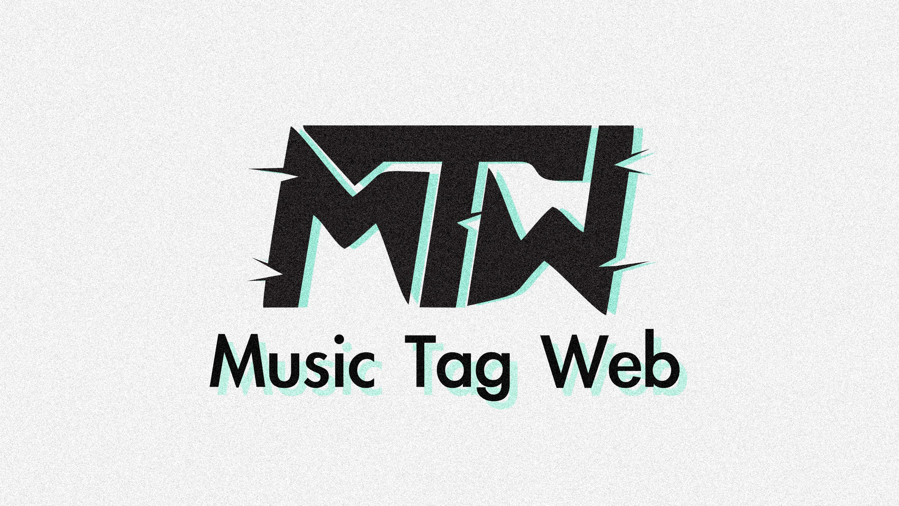

# 🚀 Go Music Tag Web — Self-hosted Docker 音乐元数据批量编辑工具（Go + gRPC + React）
[简体中文](README.md) | [English](#)

<div class="column" align="middle">
    <a href="https://go.dev/dl/"></a>
    <a href="https://react.dev/"></a>
    <a href="https://grpc.io/"></a>
    
    
</div>

> ⚠️ **本项目 fork 自 [`xhongc/music-tag-web`](https://github.com/xhongc/music-tag-web)**——原 Python/Django 单体代码已**完整重构**为 Go 1.23 + gRPC 微服务插件 + React 19 SPA 架构。本仓库以 GPL V3 协议 fork-publish 独立维护；上游著作权与许可证全文保留在根目录 [`LICENSE`](LICENSE)。重构过程的 rationale 详见底部 [Acknowledgements](#acknowledgements)。

---

## 项目简介

**Go Music Tag Web** 是一款 self-hosted、Docker 化、面向 NAS / 远程影音服务器 / Homelab 自建玩家的批量音乐元数据编辑工具：浏览器远程编辑本地私有曲库的标题、专辑、艺术家、歌词、专辑封面等元数据，作为 [Navidrome](https://www.navidrome.org/) / [Jellyfin](https://jellyfin.org/) / [Funkwhale](https://funkwhale.audio/) 等自托管音乐服务器的 sidecar 服务。

支持 [FLAC / APE / WAV / AIFF / WV / TTA / MP3 / M4A / OGG / MPC / OPUS / WMA / DSF / MP4] 全部主流有损/无损格式；**所有音乐文件本地处理，不上传第三方**；适配群晖、威联通、unRAID、Linux 小主机、amd64 / arm64 架构。

后端 HTTP gateway 与后台 worker 拆为两个独立容器；7 个音乐源（netease / kugou / kuwo / migu / qmusic / musicbrainz / acoustid）**每个都是独立 gRPC 微服务进程**，独立部署、独立失败隔离。Tag I/O 走原生 Go 库（`bogem/id3v2` + `dhowden/tag`），无 FFI / 无 virtualenv / 无外部 binary 调用链。前端是 React SPA，状态走客户端 Zustand + `localStorage` 持久化。整套镜像约 ~80 MB。

---

## 当前架构

| 层 | 实现 |
|---|---|
| HTTP 服务 | Go 1.23 + gin (gateway：API + React SPA 静态 + `/media/*` Range 流) |
| 异步任务 | asynq + Redis (worker) |
| 音乐源 | **gRPC 微服务**：7 个元数据源（netease / kugou / kuwo / migu / qmusic / musicbrainz / acoustid）+ 1 个下载源（youtube）— 各自独立进程 |
| Tag I/O | `bogem/id3v2` + `dhowden/tag`（纯 Go 库，无 Python FFI） |
| 前端 | React 19 + Vite 7 + TypeScript + Tailwind 4 + shadcn/ui + Zustand |
| 鉴权 | JWT in-memory + bcrypt；fail-closed 默认值检测 |
| 加密 | gRPC TLS 可选（env `GRPC_USE_TLS=1` + 可选 `GRPC_TLS_CA_FILE`） |
| 部署 | 单条 `docker compose up -d --build` 拉起 gateway + worker + 8 gRPC plugin + redis（nginx 已合并进 gateway，不再有独立服务；React SPA 已烘进 gateway 镜像，不需要 host 侧先 build） |
| Docker image | gateway ~17 MB、worker ~16 MB（纯 Go）、7 个音乐源插件各 ~13 MB、youtube 插件 ~190 MB（唯一带 yt-dlp + ffmpeg 的镜像） |

完整 operator 视角的安全默认值见 [`SECURITY.md`](SECURITY.md)；plugable plugin 设计草图见 [`docs/plugable-plugins.md`](docs/plugable-plugins.md)。

---

## 🎉 核心功能 Feature（self-hosted · 浏览器管理本地 NAS 曲库）

> 标记：`✅` 已实现 · `🚧` 部分实现（已知 gap）· `❌` 暂未实现（在当前 roadmap 之外）。完整 status 表与 `path` 引用见 [`docs/FEATURE-COVERAGE.md`](docs/FEATURE-COVERAGE.md)。

### 标签编辑 ✅
- 全格式音频 ID3 / Vorbis / APE tag 读写 ✅
- 批量编辑（多文件统一字段）+ 单条编辑（实时表单） ✅
- 歌词 + 封面 sidecar 自动落盘 ✅
- 列编辑（per-row inline） 🚧 — 只支持 selection+apply，单行 live-edit UI 还在做

### 元数据刮削与查找 ✅
- **7 个音乐源** 自动 fan-out 聚合：网易云 / 酷狗 / 酷我 / 咪咕 / QQ 音乐 / MusicBrainz / AcoustID 指纹 ✅
- 搜索结果去重 + 按匹配度排序 ✅
- AcoustID：没有元数据 / 文件名混乱的歌曲自动指纹识别匹配 ✅
- 搜索源动态启用 / 关闭（`localStorage` per-user 持久化，SettingsModal 中切换） ✅
- per-source YAML config override (C.4 Stage B) ✅ — 编辑 `data/sources/<name>.yaml` 改 `api_base` + `secrets.<plugin>Secret`，gateway 启动期加载 + `POST /api/sources/refresh/` 热重载（不需重启）；SettingsModal “Sources” tab 查看当前生效 + 重载按钮，secret 不暴露明文（仅 `hasSecret` 布尔）。Plugin server.go 各自 `SetSecret` / `SetAPIBase` method（const→var demote）。

### 歌词 ✅
- 多源歌词拉取（网易云 / 酷我 / 咪咕 / QQ） ✅
- 写回 lyrics tag + 同名 `.lrc` sidecar ✅
- 内嵌双语歌词（中文-英文混排 + 翻译） ❌ — 当前不引入第三方翻译 API（成本 + 隐私）

### 封面 ✅
- 远端封面拉取（带 SSRF 防护） ✅
- 上传自定义封面 ✅
- 批量导出/打包封面 zip 🚧 — 单条上传 ✅，批量 zip 工作流未实现

### 曲库 / 文件管理 ✅
- 目录递归扫描（symlink-aware） ✅
- 多维度排序：文件名 / 大小 / 修改时间 ✅- 按艺术家 / 专辑 分组 UI ✅ — `useWorklistStore.grouping` (持久化 `worklist.grouping.v1` localStorage) + chip row `[无] [专辑] [歌手]` + `GroupHeaderRow.tsx` (`var(--surface-2)` 背景 + chevron toggle + count badge) + 跨 group 多选 + collapse state session-only
- 文件名解析前后端 round-trip ✅ — Server preview `POST /api/tag/preview_parse_filenames/` 返回 token + 每行 `{artist,title,status}` (10 分钟 TTL cache)；modal 可覆盖；apply `POST /api/tag/apply_parsed_filenames/` 走 asynq `TypeApplyParsedFilenames` worker 批量写 tag。双向 contract test: Go + TS 双引擎在 200+ shared NFC fixture 上 deep-equal (SHA-256 fixture 一致校验)
- 整轨 APE / FLAC + CUE 自动切割分轨 ❌ — 仓库内没有 CUE 解析 / 切轨代码（镜像也未装 `shntool` / `cuebreakpoints`）
- ffmpeg 任意格式批量转换 ❌ — youtube 插件镜像**已装** ffmpeg（yt-dlp `--extract-audio` 转码需要，worker 委托该插件执行下载），缺的是转换 task 与 UI，不是 binary

### 文本清洗 / 编码 🚧
- 批量 tag 文本替换（脏标签、乱码清理） 🚧 — 前端 Replace 模态框已实现，无后端 bulk endpoint
- 繁简 / 简繁 metadata 转换（zhconv） ❌ — `internal/tasks/matchscore.go` 显式 defer；未引入 opencc / HanziConvert

### 下载 / 抓取 ✅
- YouTube / B 站等下载走 yt-dlp ✅
- yt-dlp 参数 sanitize（防止 `--exec=` 注入） ✅
- 5 个音乐源 download plugin：网易云 / 酷狗 / 酷我 / 咪咕 / QQ ✅

### UI / 设备 🚧
- 全响应式手机 UI（Tailwind sm/md/lg 触发） ✅

### 播放统计 ❌
- 播放数据柱形图 / 折线图 ❌ — DB `AccessedDate` 列已 reserved 但未消费；前端无 chart 组件
- 外部播放端统计上报（Subsonic-compatible `/rest/` endpoints） ❌

### 操作日志 ✅
- 完整 changelog（每次编辑可追溯） ✅ — GORM `OperationLog` 模型与持久化 + 自动记录单曲/批量标签编辑、自动刮削、文件名解析应用、目录整理、音频下载与封面上传 + 侧边栏「操作审计」管理面板（支持操作类型/状态多维过滤、模糊检索、查看变动详情与一键清空日志）

➡️ 完整 status 表 + 每个 feature 的 `path` 引用见 [`docs/FEATURE-COVERAGE.md`](docs/FEATURE-COVERAGE.md)。

---

## 💯 部署指南（docker compose · 单条命令拉起全栈）

> ⚠️ **新增懒人模式 (v2.1)**：谁不想编辑 `.env`、不想自己生成 JWT，谁可以只看下面 “🎯 一键部署 (懒人模式)” 一节；全新部署 + 注册 admin 只需 5 条 bash 命令。需要明确控制 secrets / CORS / gRPC TLS / mysql 等高级选项才看下面 Pre-flight。

> **新部署**直接走下方 Clone → env → compose 三步。从其他来源（V1 老镜像 / 旧 fork）升级请先参考下方的 `Pre-flight · boilerplate 检查` 段（包含 `.env` / `data` / `music` 路径迁移的 `mv -n` 步骤）。
>
> ⚠️ **首次部署务必先构建前端**：`cd frontend && npm install && npm run build && cd ..`——湖区 ⚠️ 省略这一步，gateway 的 `/` 会返回 404（`./static/dist/` 在 host 上还不存在）。原因：v2 起 nginx 反代被合并进 gateway，静态产物采用 host `./static/dist/` 卷装入容器，底层没有 fallback。**修改前端后**只需重跑 `npm run build`：http.ServeFile 每次请求重新读盘，Vite hashing 出新文件名让浏览器自动拉新；不需要 `docker compose restart` 或 `--build`。

### 🎯 一键部署（懒人模式 · 适合评估 / 家庭自用）

> 适合第一次部署 / NAS 评测 / “我不想手生 config” 场景。仅 5 条 bash，所有 secret 在 gateway 首次启动时由 crypto/rand 生成、bcrypt-hash 后写到 `./data/.bootstrap-creds`（host 路径），重启后保持。

```bash
# ① clone & cd（替换为你的 fork URL）
git clone https://github.com/[your-org]/go-music-tag-web.git
cd go-music-tag-web

# ②首次运行必要：创建 ./music ./data ；构建前端 → ./static/dist
mkdir -p ./music ./data
( cd frontend && npm install && npm run build && cd .. )

# ③拉起全栈（自动生成 admin 账号、JWT secret、webhook token）
docker compose up -d --build

# ④等约 30 s 后查看首启口令
docker compose logs gateway | grep -A 6 FIRST-BOOT
#   admin user:                  admin
#   admin password (PLAINTEXT):  ← 记录这一行 ←
#   JWT_SECRET (base64, 48B):    ...
#   WEBHOOK_INTERNAL_TOKEN:      ...
#   persisted to:                /app/data/.bootstrap-creds

# ⑤打开浏览器
xdg-open http://localhost:9150/admin     # macOS 用 open；Windows 用 start
```

**首次启动的工作流程：**
- `docker-compose.yml` 把 `JWT_SECRET` / `ADMIN_USERS` / `WEBHOOK_INTERNAL_TOKEN` 默认设成空 → gateway 看到空 → `ensureBootstrap()` 读取 `/app/data/.bootstrap-creds`，文件不存在则用 crypto/rand 生成三个 secret + bcrypt 一个 admin 密码，FATAL 返回如未写出来。
- 明文 admin 密码只出现一次：位于 gateway startup log 的 `FIRST-BOOT auto-bootstrap` banner；之后仅 `.bootstrap-creds` 里的 bcrypt hash 用于身份验证。
- 转发丢给同一个 `./music` 和 `./data` bind mount，静默重启后密钥保持。

**退出懒人模式 / 显式控制 secrets：** cp `.env.example .env` 后填入明确值（可参考下面 Pre-flight），gateway 检测到任何 non-empty / non-sentinel 的 env 后跳过 auto-bootstrap 对应项；其余仍是 auto-filling。

### Pre-flight · boilerplate 检查

进入 deploy 之前**必须**读完 `.env.example` 顶部的 `⛔ PRE-FLIGHT CHECKLIST ⛔`。三项 `__REPLACE_ME__` 占位符（`JWT_SECRET`、`ADMIN_USERS`、`WEBHOOK_INTERNAL_TOKEN`）未替换会被 gateway `config.Load()` 在启动时 `log.Fatalf` 拒掉（除非显式设置 `ALLOW_INSECURE_DEFAULTS=1`，**仅 dev 可用**）。`docker-compose.yml`、`.env.example`、所有 Dockerfile 在仓库根，不需要再 cd 进子目录。

> ⚠️ **从更早版本升级再看本节**（全新部署跳过）。新 compose 默认路径改到仓库根，裸 `git pull && docker compose up -d` 会让 sqlite 重建、`./music` / `./data` 目录不存在而启动失败。这 4 行 `mv -n` 在任何时机都会成功——`{.env,data,music}` 即使 git 已不再跟踪，仍写在 NAS 上。
>
> 若你的曲库实际并不在仓库根 `./music` 下（例如 Synology `/volume1/music`、SMB `/mnt/nas/music`、NFS 等外部 mount，或你此前的旧 fork 用过宿主机 bind），**不要**靠 `mv` 把海量文件搬到 `./music`；直接在仓库根 `ln -s /volume1/music ./music` 软链即可，`docker compose up` 仍能用 over the symlink。
>
> 下面 bash 块用 `mv -n`（POSIX no-clobber）：拒绝覆盖已有 backup；re-run 时两次 mv 都 no-op，状态可观察而不是静默覆盖。
> ```bash
> # 旧 fork 里如果你之前手动迁出过 `.env` / `data` / `music`，现在这些文件已经直接放在仓库根下了。
> # 升级只需：把任何之前手动建过的 `.env.bak` 拷回根 `.env`。全新部署直接 `cp .env.example .env` 即可。
> [ -f ./.env.bak ] && cp ./.env.bak ./.env  # 仅当你此前手动建过 `.env.bak` 时
> ```
> 之后 `docker compose up -d --build`。仓库根 `./music` / `./data` 即被 bind 进容器（不再走 `${MUSIC_DIR}` / `${DATA_DIR}` env 值插值），搬完后语义不变。

### 1. 克隆 + env

```bash
git clone https://github.com/[your-org]/go-music-tag-web.git   # 替换为你的新 repo URL
cd go-music-tag-web
cp .env.example .env           # 与 docker-compose.yml 同目录，Compose 才能读到
# 编辑 .env，填入必填项
```

`JWT_SECRET` 和 `ADMIN_USERS` 是必填（不设 / 占位 → gateway 启动 Fail-closed 或登录拒绝）；强烈建议同时配置 `CORS_ALLOWED_ORIGINS`、`GRPC_USE_TLS`、`GATEWAY_PORT`。`MUSIC_DIR` / `DATA_DIR` 不再从 `.env` 注入（已硬编码到 `docker-compose.yml` 的 `./music` / `./data` host bind mount），若需指向外部 mount 直接 `ln -s` 进仓库根即可。模板里每项都有详细注释。

### 2. Volume pre-flight + 构建 + 启动全栈

`docker-compose.yml` 的默认值 `./music`、`./data` 都是**相对 compose 文件路径**，首次运行必须存在；否则 `docker compose up` 会报 `volume source not found`。NAS 用户使用 SMB / NFS 挂载，先在宿主机准备好路径。

**React SPA 不需要手动构建。** 镜像内已包含前端：`Dockerfile.gateway` 的 `frontend` stage 会跑 `npm run build` 并把产物 `COPY` 进 `/app/static/dist`。因此 compose 里**没有** `./static` 挂载 —— 手动加一个反而会用空目录遮蔽镜像内的 bundle，让 `/` 返回 "SPA not built"。仓库根的 `./static/` 只是本地 `go run` gateway 时的开发目录（git 不跟踪）。

```bash
mkdir -p ./music ./data         # 首次需要（相对仓库根路径）
# 容器以 uid/gid 10001 非 root 运行（REVIEW.md P3-2）；bind mount 的属主
# 来自宿主机，镜像里改不了，所以这两个目录必须交给 10001。
# 从旧版本（root 运行）升级时这一步是必须的，否则 gateway 会 FATAL。
sudo chown -R 10001:10001 ./music ./data
docker compose up -d --build    # 后续只要不加 plugin / 不改 .env，重启即可跳过 --build
```

> 不想改宿主机目录属主？也可以在 compose 里给 `gateway` / `worker` 加 `user: "${UID}:${GID}"`（用你自己在宿主机上的 uid），但那样容器内就是你的 uid 而不是 10001 了。
> `audio-cache` 是 named volume，首次创建时 Docker 会从镜像里的 `/tmp/audio_cache` 目录（含属主）拷贝内容，不需要任何额外操作。

不用 Docker 时才需要手动构建前端：`cd frontend && npm install && npm run build`，产物落盘到仓库根 `./static/dist/`，再把 `STATIC_DIR` 指向仓库根 `./static`。

首次启动会自动构建：gateway（含 API + 静态 SPA + `/media/*` 音乐流）+ worker + 7 个 gRPC 音乐源插件（netease / kugou / kuwo / migu / qmusic / musicbrainz / acoustid）+ redis。**原 nginx 反向代理已合并进 gateway；不再需要独立的 `nginx` 服务或 `nginx.conf`。**

### 3. 浏览器访问

`http://localhost:9150/admin`（gateway 直接对外服务 `${GATEWAY_PORT:-9150}`，容器内监听 8001；同时还提供 `/api/*` 接口、`/media/*` 音乐流式、以及 `/` 的 React SPA 静态产物）。

> 默认账号由 `ADMIN_USERS` 决定。**懒人模式下**首次启劄后 admin 账号是 auto-bootstrap 生成的强随机口令（见 `docker compose logs gateway`）；**手动部署**下，未指定 `ADMIN_USERS` 会导致 login 拒绝 (`ALLOW_INSECURE_DEFAULTS=1` 仅作为 dev 模式下 `admin/admin` 退路).

---

## 🔒 安全默认值（v2 · 摘要）

本项目在 P1 完成后做过一轮集中 hardening，全部 6 项修复均已落地、对应测试就位。完整 operator 视角见 [`SECURITY.md`](SECURITY.md)。

- **CORS 白名单（无反射）**：`internal/gateway/middleware/cors.go` 读 `CORS_ALLOWED_ORIGINS`，空列表 = 拒绝全部跨域。
- **SSRF 拒 169.254 / RFC1918**：远端封面拉取走 `internal/netguard/ssrf.go`，解析后拒绝 loopback / 私有网段 / link-local / multicast。
- **路径遍历 `SafeJoin`**：所有用户传入路径强制 containment 在 `MUSIC_DIR` 下。
- **yt-dlp 参数 sanitize**：`internal/ytdlp` 阻止 `--exec=` 注入，format / quality / output 走 enum；三层防线（gateway 预校验 → worker 重放校验 → youtube 插件拼 argv 前再校验）。
- **admin / JWT 默认值 Fail-closed**：`config.Load()` 看到占位 `JWT_SECRET` 会 `log.Fatalf`；`ADMIN_USERS` 未设且无 dev flag → `loadUsers()` 返回空。
- **gRPC TLS 可选**：插件间互联走 plaintext 或 TLS，env 控制 `GRPC_USE_TLS=1` + 可选 `GRPC_TLS_CA_FILE`。
- **容器非 root**：gateway / worker / plugin 镜像均以 uid/gid 10001 运行（REVIEW.md P3-2），不再以 root 挂载整个曲库。升级时需 `chown -R 10001:10001 ./music ./data`。

这些项的测试分别落在 `internal/utils/pathjoin_test.go`、`internal/netguard/ssrf_test.go`、`internal/ytdlp/sanitize_test.go`、`internal/gateway/middleware/cors_test.go`。

---

## 🛠️ 本地开发测试

> 面向 contributor：本地改完代码后如何快速验证、如何跑 pre-flight gate、再走 docker compose 全栈热部署。下面的命令以**仓库当前**盘上文件为准——若有标 ⚠️ 的项表示暂缺 / 行为受限。

### 0. 一次性环境准备

```bash
# 本地 toolchain 验证
node -v                                    # Node ≥ 22（与 frontend/package.json engines 一致）
go version                                 # Go 1.23+
docker compose version                     # compose v2

# 拉依赖（前端一次性；后端用 go modules，缓存后不必重拉）
( cd frontend && npm install )
go mod download  # go.mod 在仓库根，不需要 cd 子目录
```

> ⚠️ 当前没有 Makefile 入口。本节直接走裸 `go` 命令，不依赖任何 build-script。

### 1. 后端（Go）

```bash
# go.mod 在仓库根；不需要 cd 子目录
# 静态检查（与 CI 等价）
go vet ./...

# 编译所有 binary：gateway + worker + 7 个 plugin
go build ./cmd/gateway/ ./cmd/worker/
for p in netease kugou kuwo migu qmusic musicbrainz acoustid; do
  go build -o /tmp/music-tag-plugin-"$p" "./cmd/plugins/$p/"   # 临时放置，让 vendor 错开
done

# 单独跑某个 plugin（开发期常用，便于把 log 隔离到 host）
NETEASE_PORT=50051 go run ./cmd/plugins/netease
```

> ⚠️ 当前仓库 `internal/**` 下没有 `_test.go` 入库。`go test ./...` 会直接报 `no test files`。质量 gate 落在 `go vet` + `go build` 上；如果要把测试补回来，可参考 [`docs/FEATURE-COVERAGE.md § 8`](docs/FEATURE-COVERAGE.md) 列出的安全项逐项拆出来写。

### 2. 前端（React + Vite）

```bash
cd frontend

# typecheck（不触发 vite build，最快）
# ⚠️ 不要用 `npx tsc --noEmit`：本目录的 tsconfig.json 是 solution 配置
#    （"files": [] + references），直接对它跑 tsc 会检查 0 个文件并静默
#    返回 0。必须走 `tsc -b` 才会跟随 references 覆盖
#    app / node / test 三个 project（含 *.test.ts）。
npm run typecheck

# dev server，HMR；默认 http://localhost:5173
npm run dev

# production build（内部跑 tsc -b && vite build）
npm run build

# lint
npm run lint
npm run lint:fix          # eslint --fix 自动修
```

### 3. 一键 pre-flight gate（与 CI 等价）

```bash
# 五道 gate，全部 exit 0 才算绿灯
docker compose config --quiet
go vet ./...
go build ./cmd/gateway/ ./cmd/worker/  # go.mod 在仓库根
( cd frontend && npm run typecheck )   # = tsc -b；别用 tsc --noEmit，见上
( cd frontend && npm run lint --silent )
```

### 4. 全栈热部署（改完任一 service 后）

```bash
# 仅改某一 service 时，定向 rebuild（其他容器不停）
docker compose up -d --build gateway
docker compose up -d --build worker
docker compose up -d --build netease      # 任意 plugin 同理

# 改 Dockerfile / `.env`：全栈 rebuild
docker compose up -d --build

# 实时 log
docker compose logs -f gateway
docker compose logs -f worker
docker compose logs -f netease
```

### 5. host 跑 gateway + plugin（不走容器，便于 in-process 调试）

```bash
# 终端 1：host 跑 gateway，方向 localhost 上 plugin
GATEWAY_PORT=8001 \
  PLUGIN_NETEASE_ADDR=localhost:50051 \
  JWT_SECRET="$(openssl rand -base64 48)" \
  ADMIN_USERS=test:test \
  CORS_ALLOWED_ORIGINS=http://localhost:5173 \
  go run ./cmd/gateway

# 终端 2：host 跑 plugin
NETEASE_PORT=50051 go run ./cmd/plugins/netease

# 终端 3：curl 验证
curl http://localhost:8001/api/sources/           # 列表里应该有 netease
curl 'http://localhost:8001/api/search_music/?q=test'
```

### 6. 故障排查速查

| 现象 | 第一步 |
|---|---|
| gateway `FATAL: JWT_SECRET is unset or equal to the placeholder` | 仓库根目录 `.env` 补 `JWT_SECRET=$(openssl rand -base64 48)`（如果走懒人模式变体：检查 `./data/.bootstrap-creds` 是否存在且可写） |
| gateway `FATAL: cannot persist bootstrap creds to /app/data/.bootstrap-creds` | `./data` 不存在或不可写；`mkdir -p ./data` 并确保 host 上 777 权限 / 非 root 用户。也可以绕开：`cp .env.example .env` 然后填真值。 |
| 看不到 `FIRST-BOOT auto-bootstrap` banner | 大约需要 25–40 s：gateway 在做 DB init、dial 所有 plugin、bbolt 加载。不要 grep `docker compose logs gateway`，改用 `docker compose logs -f gateway` 跟随。重启后该 banner 不会再出现，仅明文 admin 密码被回收（首启后清零）。|
| `docker compose up` 报 `volume source not found` | 先 `mkdir -p ./music ./data` |
| `npm run typecheck` 类型错 | 先看 `frontend/src/types/index.ts` 是否漏类型定义。注意这个命令必须用 `tsc -b`；`npx tsc --noEmit` 对本仓库的 solution 配置不检查任何文件，会假绿 |
| `npm run lint` 报 `react-hooks/exhaustive-deps` 等 | `npm run lint:fix` 自动修，或手动补依赖项 |
| gateway healthcheck 一直 unhealthy | `docker compose logs gateway` + `docker compose logs redis` 看联通 |
| AcoustID 搜索没结果 | worker 镜像缺 `libchromaprint-tools`；host 侧 `apt-get install -y libchromaprint-tools` 或自行把它塞进 `Dockerfile.worker` |

完整 operator 安全默认值见 [`SECURITY.md`](SECURITY.md)；功能 status 表见 [`docs/FEATURE-COVERAGE.md`](docs/FEATURE-COVERAGE.md)；架构设计与 future stages 见 [`docs/plugable-plugins.md`](docs/plugable-plugins.md)。

---

## 📚 相关文档

- [`docs/FEATURE-COVERAGE.md`](docs/FEATURE-COVERAGE.md) — Feature status 单一来源；本 README Features list 的所有 ✅/🚧/❌ 都对应这条 matrix 的 row 编号
- [`SECURITY.md`](SECURITY.md) — 完整运维安全默认值 / 威胁模型 / runbook
- [`docs/plugable-plugins.md`](docs/plugable-plugins.md) — 插件架构设计草图（Stage A 已落地 / B–D 暂未排期）
- [`frontend/README.md`](frontend/README.md) — 前端 dev 启动 / Vitest / React Compiler 配置
- [`AGENTS.md`](AGENTS.md) — 仓库内协作工具相关说明

---

## 🌟 Star History

[](https://star-history.com/#xhongc/music-tag-web&Date)

<!--
self-hosted, music tag editor, docker music metadata tool, NAS flac tagger,
navidrome sidecar tag editor, jellyfin batch id3 editor, homelab music manager,
docker gRPC plugin music scraper, react tailwind shadcn music tag editor,
golang music library manager, self-hosted docker music tagger,
自托管音乐标签工具, docker 音乐元数据编辑器, 群晖音乐批量改标签,
威联通无损曲库整理, 替代 mp3tag 网页版, 音乐指纹识别刮削标签,
本地私有曲库管理, Go Music Tag Web
-->

---

## <a id="acknowledgements"></a>Acknowledgements · 上游与重构说明

本项目的 **upstream** 是 [`xhongc/music-tag-web`](https://github.com/xhongc/music-tag-web) ，最初由 *xhongc* 维护，原仓库以 **GPL V3** 协议开源。本仓库 fork 自该 upstream，并对整份代码做了**完整重写**：

| | upstream | 本仓库 |
|---|---|---|
| 后端 | Python 3 + Django + gunicorn + celery | Go 1.23 + gin + asynq + Redis |
| 音乐源 | 同进程 python module | 独立 gRPC 服务进程 |
| Tag I/O | `mutagen` (Python 库) | `bogem/id3v2` + `dhowden/tag`（纯 Go） |
| 前端 | Django template + Bootstrap jQuery | React 19 + Vite 7 + TypeScript + Tailwind 4 + shadcn/ui + Zustand |
| 部署 | 单 Python 容器 (~600 MB) | 多 service compose（gateway + worker + 7 gRPC plugin + redis），总 image ~80 MB（nginx 已合并进 gateway，v2 不再携带独立 nginx service) |
| 鉴权 | Django session | JWT in-memory + bcrypt |
| 默认配置保护 | 软默认值 | Fail-closed（占位 JWT_SECRET / 默认 admin 都被拒） |

**本仓库沿用 GPL V3 协议**——[`LICENSE`](LICENSE) 内容未做任何修改，上游著作权声明与许可证全文完整保留。任何对本仓库的使用、再分发、修改，都必须遵守 GPL V3 条款（即：同等开源 + 保留版权声明 + 注明修改）。

本仓库的修改记录以 git commit 历史为准；上游提供的功能（`docs/FEATURE-COVERAGE.md` 中带 ✅/🚧/❌ 标记的 22 个 claim，其中 11 个已完整迁移 + 5 个部分迁移 + 6 个未迁移）保留溯源痕迹，README 内的功能列表与 [`docs/FEATURE-COVERAGE.md`](docs/FEATURE-COVERAGE.md) row 一一对应。

**侵权投诉 / 版权诉求**：如收到版权方对歌词、封面、专辑元数据的诉求，将在 24 小时内按上游 LICENSE 与 GPL V3 条款要求清理数据。本仓库仅编辑本地已有音乐文件元数据，**不下载、不存储、不分发任何受版权保护的音频本体**。欲联系维护者请用 GitHub Issues / Pull Requests 公开流程，或邮件 [maintainer@your-domain.example]（占位，按需替换）。

---

## <a id="license"></a>License

GNU General Public License **v3.0** — 完整文本见 [`LICENSE`](LICENSE)。

```
Go Music Tag Web
Copyright (C) <year>  <name of author>

This program is free software: you can redistribute it and/or modify
it under the terms of the GNU General Public License as published by
the Free Software Foundation, either version 3 of the License, or
(at your option) any later version.

This program is distributed in the hope that it will be useful,
but WITHOUT ANY WARRANTY; without even the implied warranty of
MERCHANTABILITY or FITNESS FOR A PARTICULAR PURPOSE.  See the
GNU General Public License for more details.

You should have received a copy of the GNU General Public License
along with this program.  If not, see <https://www.gnu.org/licenses/>.
```

---

## 免责声明 / Disclaimer

**禁止任何形式的商业用途**，包括但不限于售卖 / 打赏 / 获利 / 广告分成。本项目仅供个人私下研究学习技术使用，与原 upstream 仓库解耦后**独立维护**。

**本项目仅编辑本地已有音乐文件的元数据，不提供、不下载、不存储任何受版权保护的音频本体。** 仓库内置的 7 个音乐源 plugin（netease / kugou / kuwo / migu / qmusic / musicbrainz / acoustid）只向各官方平台的公开服务器发起查询请求，**不绕过任何身份验证、不缓存任何受版权保护的内容**；抓取到的元数据（曲名 / 歌手 / 专辑名 / 封面 URL / 歌词文本）属于上游各官方平台的版权数据，使用者应按上游 LICENSE 与各官方平台的服务条款在 24 小时内**自行清除**。

词语约定：

- “**本项目**” 指 **Go Music Tag Web**（本仓库）。
- “**原项目 / upstream**” 指 [`xhongc/music-tag-web`](https://github.com/xhongc/music-tag-web) ，即本仓库的 fork 源。
- “**使用者**” 指签署本协议 / 使用本项目的所有方。
- “**官方音乐平台**” 指对本项目内置的网易云音乐、酷狗音乐、酷我音乐、QQ 音乐、咪咕音乐、MusicBrainz 等音乐源的官方平台统称。
- “**版权数据**” 指包括但不限于图像、音频、名字、歌词等在内的他人拥有所属版权的数据。

由于使用本项目产生的、包括由于本协议或由于使用或无法使用本项目而引起的任何性质的任何直接、间接、特殊、偶然或结果性损害（包括但不限于因商誉损失、停工、计算机故障或故障引起的损害赔偿，或任何及所有其他商业损害或损失），**由使用者自行承担**。

本项目完全免费，仅供个人私下小范围研究交流学习使用，开源发布于 GitHub 面向全世界使用者作为技术学习交流。本项目不对项目内的技术可能存在违反当地法律法规的行为作保证；禁止在违反当地法律法规的情况下使用本项目；对于使用者在明知或不知当地法律法规不允许的情况下使用本项目所造成的任何违法违规行为，由使用者承担，本项目不承担由此造成的任何直接、间接、特殊、偶然或结果性责任。

**若你使用了本项目，将代表你接受以上协议。**
